# Synthetic Gaze Dataset with MetaHumans

This is a standardized dataset of eye gaze synthetically generated using MetaHumans on Unreal Engine 5.
Each directory contains 375 images of a MetaHuman character and a csv file. The csv file
contains the following columns:

* horizontal angle - The angle of the gaze in the horizontal direction. A positive value indicates that the character is looking to their right.
* vertical angle - The angle of the gaze in the vertical direction. A positive value indicates that the character is looking up.
* gaze x - The x dimension of the normalized gaze vector.
* gaze y - The y dimension of the normalized gaze vector.
* gaze z - The z dimension of the normalized gaze vector.
* aim x - The x-axis displacement of the aim box.
* aim y - The y-axis displacement of the aim box.
* aim z - The z-axis displacement of the aim box.

This dataset was created in 2022 at the University of Washington Reality Lab. Due to GitHub size constraints, this GitHub repo
only contains the dataset itself and the python tools used to define eye gazes. For the Unreal project used the generate the dataset (~20GB), please contact Duncan Du
[here](https://www.duduncan.com/contact).

## Synthesis Instructions

1. Open the Unreal project in **MetahumanScriptTest** ([contact](https://www.duduncan.com/contact) Duncan Du for the Unreal project.)

2. Import the MetaHuman into the project through Quixel Bridge.

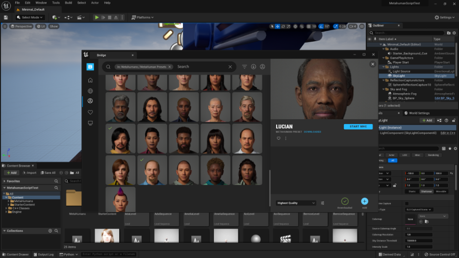

3. Create duplicates of the TemplateLevel and the TemplateSequence. Rename them according to the MetaHuman name.

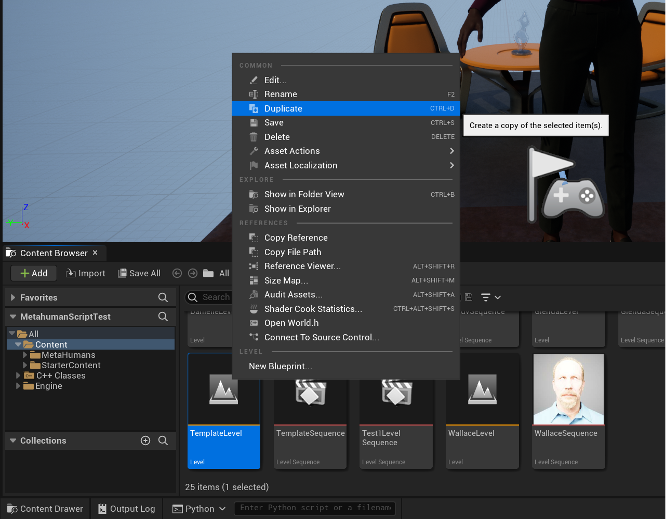

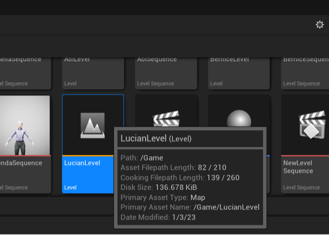

4. Open the duplicated level

5. Drag the new MetaHuman into the level

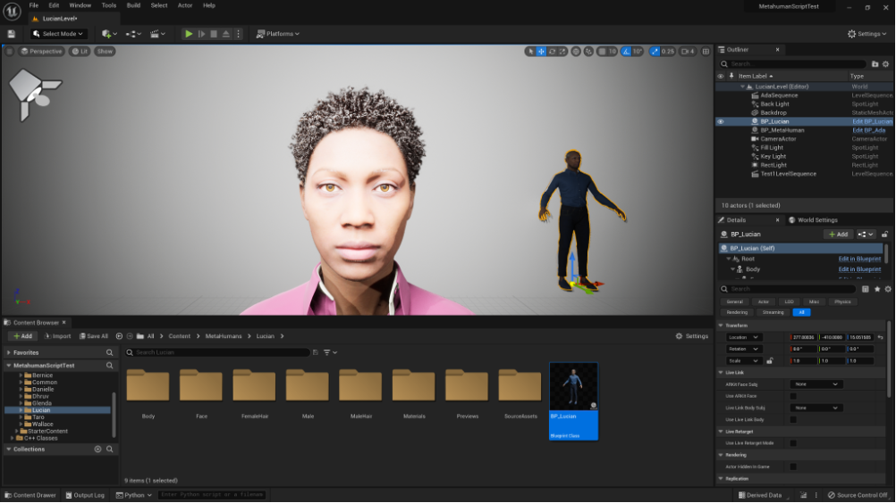

6. Replace the BP\_MetaHuman actor with the new MetaHuman

7. Delete the MetaHuman that was dragged in.

8. Adjust camera height and exposure as needed and save the level.

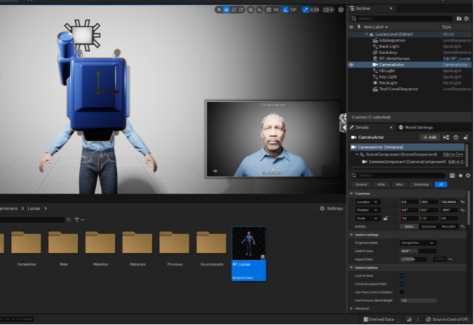

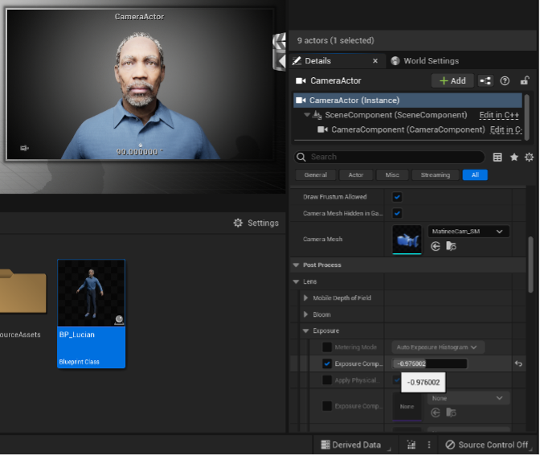

9. Open the duplicated sequence

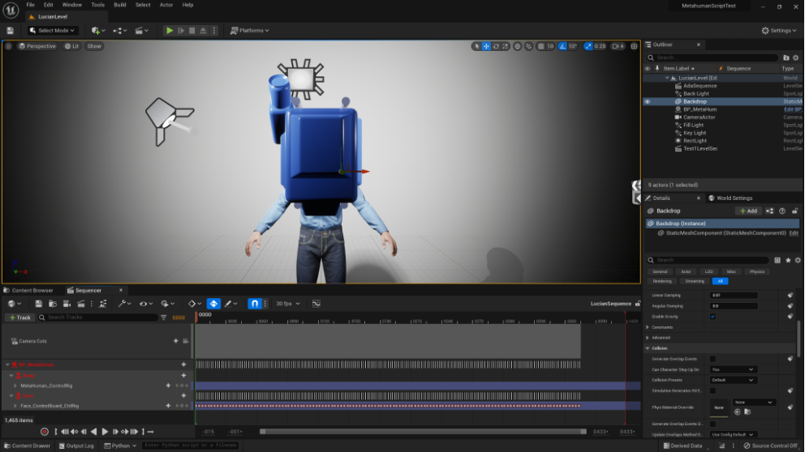

10. In the sequencer, reassign the BP\_MetaHuman to your new MetaHuman

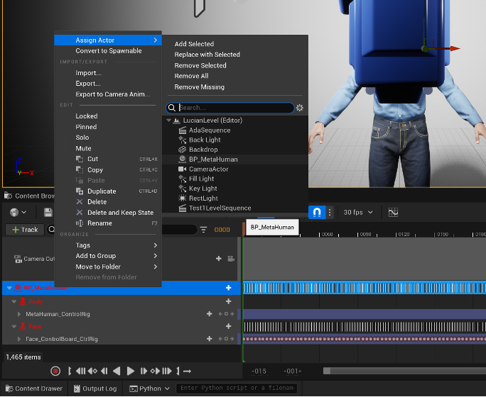

11. In Camera Cuts, track the CameraActor

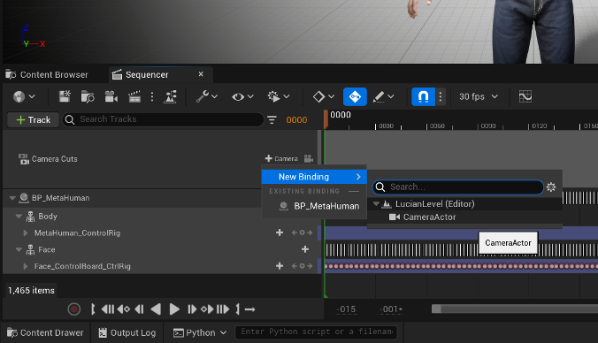

12. Make sure the render range is set to 0-375 and save the sequence.

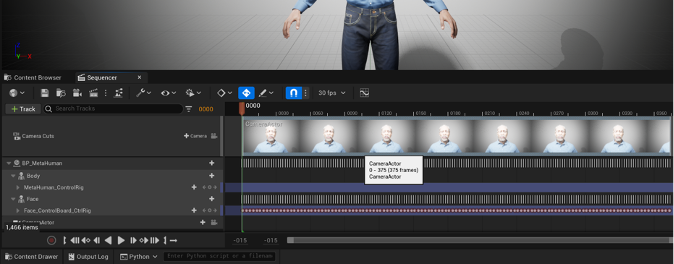

13. Render the sequence

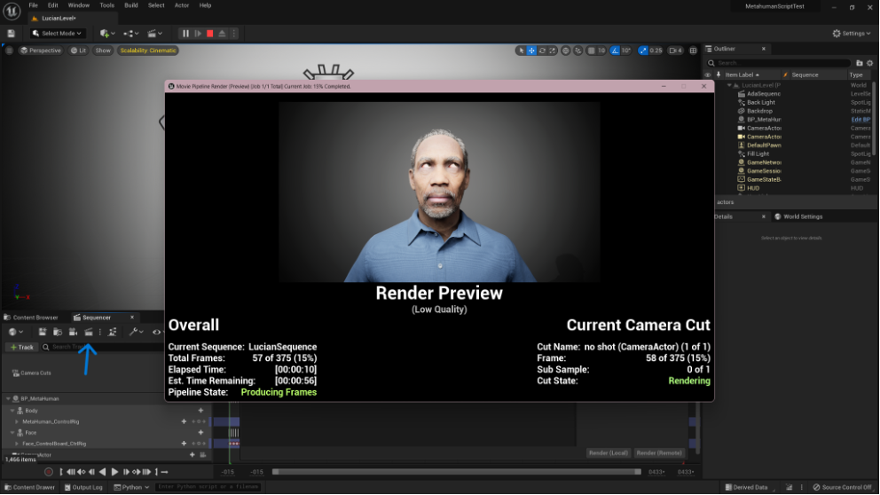